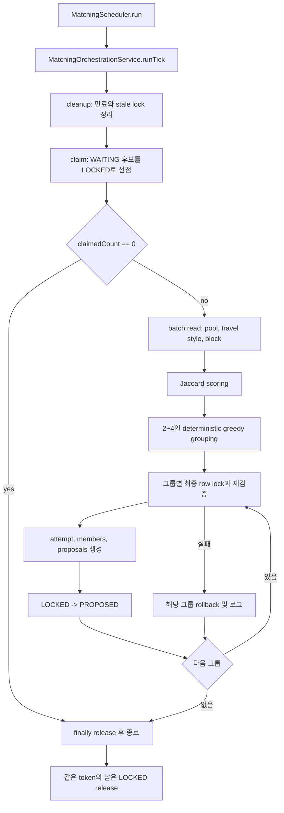
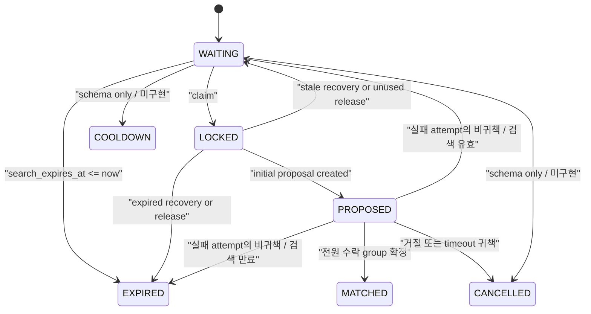
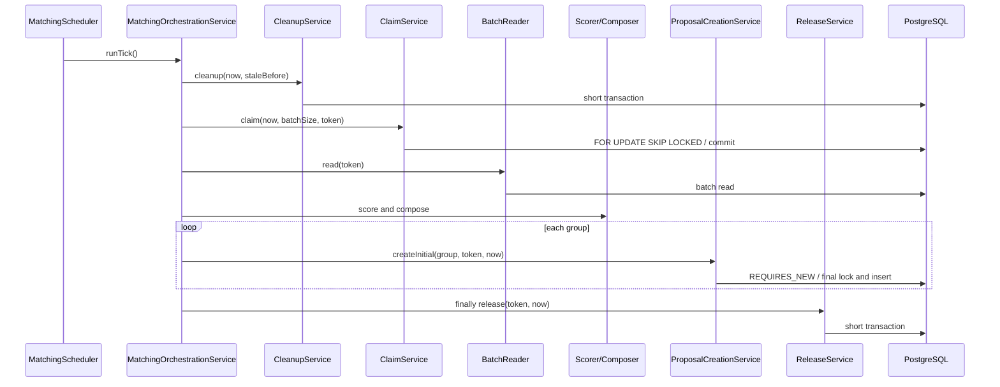

# 매칭 엔진 구현 기록

## 1. 문서 목적과 범위

이 문서는 `meet-or-solo` backend에 실제로 구현된 매칭 엔진을 코드 중심으로 설명합니다. 매칭 정책을 새로 정의하거나 DB 설계를 반복하기보다, 정책과 schema가 Spring service, PostgreSQL transaction, JUnit 테스트로 어떻게 연결되는지 정리합니다.

문서의 주요 독자는 다음과 같습니다.

- 현재 매칭 코드를 인수인계받는 개발자
- proposal 응답, REST API, frontend를 이어서 구현할 개발자
- Spring transaction과 PostgreSQL row lock을 처음 접하는 참여자
- 구현 경험을 기술 블로그로 정리하려는 참여자

현재 구현 기준은 `feature/wbs-10-matching-insufficient-members` 작업 트리이며, `c039ad9`에서 분기한 뒤 추가한 인원 미달 round 2 운영 코드와 테스트를 포함합니다.

관련 문서의 역할은 다음과 같이 구분합니다.

| 문서 | 역할 |
| --- | --- |
| [아키텍처](01_ARCHITECTURE.md) | 시스템 전체 구성과 도메인 경계 |
| [매칭 정책](05_MATCHING_POLICY.md) | 최종 매칭 정책과 상태 계약 |
| [테스트/품질 전략](09_TEST_AND_QUALITY_STRATEGY.md) | 프로젝트 전체 테스트 원칙 |
| [진행 기록](10_PROGRESS_LOG.md) | 시간순 구현 이력 |
| [DB 설계](11_DATABASE_DESIGN.md) | 테이블, 컬럼, 상태값, 제약조건 |
| 이 문서 | 실제 클래스 협력, transaction, 동시성, 테스트와 기술적 의사결정 |

이 문서에서 사용하는 구현 상태는 다음과 같습니다.

| 표시 | 의미 |
| --- | --- |
| 구현 완료 | 운영 코드와 대응 테스트가 존재함 |
| 일부 구현 | 기반 동작은 있지만 사용자 흐름 전체가 완성되지 않음 |
| schema 또는 문서 계약만 존재 | DB나 정책은 있지만 운영 코드가 없음 |
| 미구현 | 현재 저장소에 해당 운영 기능이 없음 |
| 후속 계획 | 방향만 합의됐고 아직 구현하지 않음 |

## 2. 현재 구현 수준 요약

한 문장으로 요약하면, 현재 backend는 유효한 대기 후보를 PostgreSQL에서 중복 없이 선점하고, 정형 여행 스타일로 2~4인 그룹을 조합한 뒤 최초 attempt와 proposal을 원자적으로 생성할 수 있습니다.

현재 작업 트리에는 최초 proposal 수락·거절·timeout, attempt 집계와 최종 group 확정뿐 아니라 인원 미달 round 2 재확인과 최소 인원 group 확정 운영 코드 및 테스트도 포함되어 있습니다.

### 구현 완료

- `WAITING` 후보 조회와 안전 조건 필터
- requester 중심 claim과 Scheduler 전용 batch claim
- `FOR UPDATE SKIP LOCKED` 기반 다중 worker 선점
- 만료 `WAITING` 및 stale `LOCKED` 정리
- `TravelStyleCode` Jaccard scoring
- 같은 축제·같은 `preferredGroupSize`의 2~4인 그룹 조합
- 모든 pair 평균 group score와 결정적 greedy 배정
- 생성 직전 pool row lock과 안전 조건 재검증
- `match_attempts`, `match_attempt_members`, 최초 `match_proposals` 생성
- 그룹별 `REQUIRES_NEW` rollback 격리
- 성공 pool의 `LOCKED -> PROPOSED` 전환
- 미사용·실패 lock release
- 기본 비활성 Scheduler와 조건부 scheduling infrastructure
- `INITIAL_MATCH`, round 1의 수락·거절·timeout 상태 전이
- attempt 선잠금 기반 동시 응답 직렬화와 동일 응답 멱등성
- 실패 attempt의 proposal/member/pool 정리
- 전원 수락 시 group/member 생성과 pool `MATCHED`, attempt `CONFIRMED`
- 별도 timeout service와 조건부 Scheduler 진입점
- round 1 전체 terminal 이후 3명/4명 목표의 2명 이상 수락자에 대한 인원 미달 조건 판정
- 같은 attempt의 round 2 proposal 생성과 `START_WITH_CURRENT_MEMBERS`/`CANCEL_CURRENT_MEMBERS`/`TIMEOUT` 처리
- round 2 전원 진행 동의 시 실제 인원 group 확정과 취소·timeout 시 귀책/비귀책 pool 분리

### 일부 구현 또는 기반만 존재

| 기능 | 현재 수준 |
| --- | --- |
| 매칭 신청 | requester 후보 조회·claim service는 있으나 신청 API와 pool 생성 service는 없음 |
| attempt lifecycle | `WAITING_RESPONSES -> INSUFFICIENT_MEMBERS -> FAILED/CONFIRMED`와 기존 전원 수락 확정 구현 |
| proposal lifecycle | `INITIAL_MATCH` round 1과 `INSUFFICIENT_MEMBERS_CONFIRMATION` round 2의 응답·timeout 구현 |
| cooldown | active cooldown 제외 조회와 귀책 응답 기반 생성 구현 |
| penalty | timeout·round 2 취소 점수와 append-only event 구현 |
| embedding | V11 schema만 존재. matching score에는 사용하지 않음 |
| response/group | 최초·인원 미달 응답 저장과 목표/최소 인원 group 확정 구현. REST API는 없음 |

### 미구현 또는 후속 계획

- matching REST API와 매칭 신청 API
- application-level `POOL_ENTRY` 실행 경로
- frontend, WebSocket STOMP, Redis
- embedding 또는 외부 API scoring

현재 화면에서 동작을 확인할 수 없는 이유는 REST API와 frontend 연결이 없고 Scheduler도 기본적으로 비활성화되어 있기 때문입니다. 현재 완성도는 화면 기능이 아니라 backend engine과 DB transaction 수준입니다.

## 3. 전체 처리 흐름

Scheduler tick의 실제 흐름은 다음과 같습니다.



중요한 점은 이 흐름 전체가 하나의 transaction이 아니라는 것입니다. DB row lock이 필요한 단계만 짧은 transaction으로 나누고, scoring과 조합은 row lock 밖에서 실행합니다.

관련 코드:

- [MatchingScheduler](../backend/src/main/java/com/survey/meetorsolo/domain/matching/scheduler/MatchingScheduler.java)
- [MatchingOrchestrationService](../backend/src/main/java/com/survey/meetorsolo/domain/matching/service/MatchingOrchestrationService.java)

## 4. 주요 클래스와 책임

### 설정과 Scheduler

| 클래스 | 입력 | 출력·효과 | Transaction |
| --- | --- | --- | --- |
| [MatchingConfiguration](../backend/src/main/java/com/survey/meetorsolo/domain/matching/config/MatchingConfiguration.java) | Spring context | `Clock`, scorer, composer bean | 없음 |
| [MatchingSchedulerProperties](../backend/src/main/java/com/survey/meetorsolo/domain/matching/config/MatchingSchedulerProperties.java) | `app.matching.scheduler.*` | 검증된 설정값 | 없음 |
| [MatchingSchedulingConfiguration](../backend/src/main/java/com/survey/meetorsolo/domain/matching/config/MatchingSchedulingConfiguration.java) | `enabled` | 조건부 scheduling infrastructure | 없음 |
| [MatchingScheduler](../backend/src/main/java/com/survey/meetorsolo/domain/matching/scheduler/MatchingScheduler.java) | scheduled tick | orchestration 호출 | 없음 |

### Service와 알고리즘

| 클래스 | 핵심 책임 | Transaction |
| --- | --- | --- |
| [MatchingOrchestrationService](../backend/src/main/java/com/survey/meetorsolo/domain/matching/service/MatchingOrchestrationService.java) | 단계 순서, 그룹 실패 격리, finally release | 없음 |
| [MatchPoolCleanupService](../backend/src/main/java/com/survey/meetorsolo/domain/matching/service/MatchPoolCleanupService.java) | 만료·stale 상태 정리 | `@Transactional` |
| [MatchPoolClaimService](../backend/src/main/java/com/survey/meetorsolo/domain/matching/service/MatchPoolClaimService.java) | requester 중심 후보 선점 | `@Transactional` |
| [SchedulerMatchPoolClaimService](../backend/src/main/java/com/survey/meetorsolo/domain/matching/service/SchedulerMatchPoolClaimService.java) | Scheduler batch 선점 | `@Transactional` |
| [MatchingBatchReader](../backend/src/main/java/com/survey/meetorsolo/domain/matching/service/MatchingBatchReader.java) | pool/style/block batch 조회 | read-only |
| [TravelStyleScorer](../backend/src/main/java/com/survey/meetorsolo/domain/matching/scoring/TravelStyleScorer.java) | Jaccard pair score | 없음 |
| [MatchGroupComposer](../backend/src/main/java/com/survey/meetorsolo/domain/matching/group/MatchGroupComposer.java) | 조합 생성·정렬·greedy 선택 | 없음 |
| [MatchProposalCreationService](../backend/src/main/java/com/survey/meetorsolo/domain/matching/service/MatchProposalCreationService.java) | 최종 검증·원자 생성 | `REQUIRES_NEW` |
| [MatchPoolReleaseService](../backend/src/main/java/com/survey/meetorsolo/domain/matching/service/MatchPoolReleaseService.java) | 같은 token의 남은 lock 반환 | `@Transactional` |

### Entity와 repository

| 코드 | 테이블·책임 |
| --- | --- |
| [MatchPool](../backend/src/main/java/com/survey/meetorsolo/domain/matching/entity/MatchPool.java) | `match_pools`, `lock()`, `propose()` |
| [MatchAttempt](../backend/src/main/java/com/survey/meetorsolo/domain/matching/entity/MatchAttempt.java) | `match_attempts`, 최초 attempt 생성 |
| [MatchAttemptMember](../backend/src/main/java/com/survey/meetorsolo/domain/matching/entity/MatchAttemptMember.java) | `match_attempt_members`, 후보별 score와 상태 |
| [MatchProposal](../backend/src/main/java/com/survey/meetorsolo/domain/matching/entity/MatchProposal.java) | `match_proposals`, 최초 proposal 생성 |
| [MatchResponse](../backend/src/main/java/com/survey/meetorsolo/domain/matching/entity/MatchResponse.java) | `match_responses`, 최초 proposal 응답 이력 |
| [MatchGroup](../backend/src/main/java/com/survey/meetorsolo/domain/matching/entity/MatchGroup.java) | 전원 수락 시 최종 group |
| [MatchGroupMember](../backend/src/main/java/com/survey/meetorsolo/domain/matching/entity/MatchGroupMember.java) | 확정 group 참여 회원 |
| [MatchPoolRepository](../backend/src/main/java/com/survey/meetorsolo/domain/matching/repository/MatchPoolRepository.java) | 후보 SQL, row lock, cleanup, release |
| [MatchAttemptRepository](../backend/src/main/java/com/survey/meetorsolo/domain/matching/repository/MatchAttemptRepository.java) | attempt 저장 |
| [MatchAttemptMemberRepository](../backend/src/main/java/com/survey/meetorsolo/domain/matching/repository/MatchAttemptMemberRepository.java) | attempt member 저장 |
| [MatchProposalRepository](../backend/src/main/java/com/survey/meetorsolo/domain/matching/repository/MatchProposalRepository.java) | proposal 저장 |
| [MatchResponseRepository](../backend/src/main/java/com/survey/meetorsolo/domain/matching/repository/MatchResponseRepository.java) | proposal/member별 단일 응답 조회·저장 |
| [MatchGroupRepository](../backend/src/main/java/com/survey/meetorsolo/domain/matching/repository/MatchGroupRepository.java) | attempt별 최종 group 저장 |

## 5. MatchPool 상태 전이

V3는 여러 상태를 허용하지만 현재 운영 코드가 실제로 만드는 전이는 일부입니다. 전체 상태 계약은 [매칭 정책](05_MATCHING_POLICY.md)과 [DB 설계](11_DATABASE_DESIGN.md)를 참고합니다.

| 시작 상태 | 종료 상태 | 조건 | 구현 주체 |
| --- | --- | --- | --- |
| `WAITING` | `LOCKED` | 유효 후보 선점 성공 | claim service |
| `WAITING` | `EXPIRED` | `search_expires_at <= now` | cleanup |
| `LOCKED` | `WAITING` | 유효 stale lock 또는 미사용 lock | cleanup/release |
| `LOCKED` | `EXPIRED` | stale 또는 release 시 이미 만료 | cleanup/release |
| `LOCKED` | `PROPOSED` | attempt/proposal 원자 생성 성공 | creation service |



`MATCHED`, `CANCELLED`는 최초 proposal 응답 결과에서 사용합니다. `COOLDOWN` 생성은 정책 미확정으로 아직 사용하지 않습니다.

## 6. 후보 조회와 제외 조건

후보 조회에는 두 경로가 있습니다.

| 경로 | 사용 목적 | 특징 |
| --- | --- | --- |
| requester 중심 | 향후 사용자 진입 흐름의 기반 | 특정 축제, requester 자신과 양방향 block 제외 |
| Scheduler batch | 정기 matching tick | requester 없이 전역 batch 선점, block은 batch 조합 단계와 최종 생성 단계에서 확인 |

Scheduler claim 대상은 다음 조건을 모두 만족해야 합니다.

- pool `status = 'WAITING'`
- `search_expires_at > now`
- check-in의 member와 festival이 pool과 일치
- check-in `status = 'ACTIVE'`
- check-in `expires_at > now`
- 해당 시각에 active cooldown이 없음

정렬은 `entered_at ASC, id ASC`이고 기본 batch 상한은 20입니다. 이 정렬은 오래 기다린 후보를 먼저 고려하고 동일 시각에는 작은 pool ID로 결과를 결정적으로 만듭니다.

현재 후보 SQL은 active `match_group_members`를 직접 조회해 제외하지 않습니다. group 생성은 구현됐지만 이후 group lifecycle과 새 pool 진입 경로가 아직 없으므로 후보 제외 조건은 해당 단계에서 다시 확인해야 합니다.

## 7. PostgreSQL 동시성 설계

### DB row lock과 lock_token의 차이

DB row lock은 PostgreSQL이 transaction 동안 실제 row 접근을 조정하는 물리적 잠금입니다. 같은 row를 변경하려는 다른 transaction은 기다리거나, `SKIP LOCKED`를 사용했다면 그 row를 건너뜁니다. transaction이 commit 또는 rollback되면 DB row lock은 사라집니다.

`lock_token`은 DB 컬럼에 저장되는 논리적 소유권 표시입니다. transaction이 끝난 뒤에도 “어느 matching tick이 이 pool을 선점했는가”를 추적할 수 있습니다. 다른 worker의 token을 가진 row를 최종 생성하거나 release하지 않도록 검사하는 데 사용합니다.

| 구분 | DB row lock | `lock_token` |
| --- | --- | --- |
| 관리 주체 | PostgreSQL | application과 DB row |
| 수명 | transaction 종료까지 | 명시적으로 제거할 때까지 |
| 목적 | 동시에 같은 row 변경 방지 | transaction 사이의 논리적 소유권 추적 |
| stale 가능성 | transaction 종료 시 해제 | worker 장애 시 남을 수 있음 |
| 복구 | DB가 자동 해제 | stale cleanup 필요 |

`lock_token`은 row lock을 대체하지 않습니다. 최종 생성 transaction은 token만 비교하지 않고 pool row를 다시 잠급니다.

### FOR UPDATE SKIP LOCKED

Scheduler claim의 핵심은 다음 형태입니다.

```sql
SELECT pool.*
FROM match_pools pool
WHERE pool.status = 'WAITING'
ORDER BY pool.entered_at, pool.id
LIMIT :limit
FOR UPDATE OF pool SKIP LOCKED;
```

`FOR UPDATE`는 선택된 pool row를 transaction 동안 잠급니다. `SKIP LOCKED`는 다른 worker가 이미 잠근 row를 기다리지 않고 건너뛰게 합니다. 따라서 여러 backend 인스턴스가 동시에 tick을 실행해도 서로 다른 후보 묶음을 처리할 수 있습니다.

claim transaction 안에서는 선점과 `WAITING -> LOCKED`, `locked_at`, `lock_token` 기록만 수행하고 즉시 끝냅니다. scoring까지 잠금 안에서 수행하면 다른 worker가 후보를 오래 기다리게 되고 처리량이 감소하기 때문입니다.

최종 생성 시에는 pool ID를 오름차순으로 정렬해 다시 `FOR UPDATE`합니다. 여러 transaction이 여러 row를 서로 다른 순서로 잡을 때 생길 수 있는 deadlock 가능성을 줄이기 위한 순서 규칙입니다.

JVM 전역 lock이나 장시간 PostgreSQL advisory lock은 사용하지 않습니다. 최종 안전성은 각 pool row의 DB lock, 상태와 token 검증에 둡니다.

## 8. 만료와 stale lock

cleanup은 외부에서 주입된 `now`, `staleBefore`로 실행되어 경계가 결정적입니다.

| 대상 | 조건 | 결과 |
| --- | --- | --- |
| 만료 WAITING | `search_expires_at <= now` | `EXPIRED` |
| 유효 stale LOCKED | `locked_at <= staleBefore` 및 검색 유효 | `WAITING` |
| 만료 stale LOCKED | `locked_at <= staleBefore` 및 검색 만료 | `EXPIRED` |
| 최신 LOCKED | `locked_at > staleBefore` | 보존 |
| 불완전 LOCKED | `locked_at` 또는 `lock_token`이 null | 자동 복구하지 않음 |

stale lock은 worker가 선점 후 종료되어 논리적 token이 남았을 때 발생할 수 있습니다. cleanup은 이를 다음 tick에서 다시 처리할 수 있는 상태로 복구합니다.

모든 update가 현재 상태와 경계 조건을 포함하므로 같은 cleanup을 반복해도 두 번째 실행에는 추가 변경이 없습니다. 이것이 cleanup의 멱등성입니다.

기본 stale timeout은 30초이고 fixed delay는 5초입니다. 운영 환경에서는 환경변수로 조정할 수 있습니다.

## 9. TravelStyleCode scoring

현재 scoring은 V5의 `member_travel_styles.style_code`를 사용합니다.

```text
Jaccard score = |A ∩ B| / |A ∪ B| × 100
```

예를 들어 다음 두 회원이 있다고 가정합니다.

```text
A = {PHOTO, FOOD}
B = {PHOTO, ACTIVE}
```

교집합은 1개, 합집합은 3개이므로 점수는 `33.33`입니다.

- 범위: `0.00`~`100.00`
- 한쪽 또는 양쪽 집합이 비면 `0.00`
- 입력 순서와 중복은 영향 없음
- `BigDecimal` 사용
- 소수점 둘째 자리, `RoundingMode.HALF_UP`

double을 거치지 않기 때문에 부동소수점 오차에 의존하지 않습니다. V11에는 embedding schema가 있지만 현재 `TravelStyleScorer`는 이를 읽지 않습니다. 따라서 embedding이나 외부 API가 없어도 현재 matching은 동작합니다.

관련 코드: [TravelStyleScorer](../backend/src/main/java/com/survey/meetorsolo/domain/matching/scoring/TravelStyleScorer.java)

## 10. 2~4인 그룹 조합

`MatchGroupComposer`는 후보를 `(festivalId, preferredGroupSize)`로 나눈 뒤 정확한 희망 인원 크기의 모든 조합을 생성합니다.

그룹 점수는 그룹 내부 모든 2인 pair 점수의 평균입니다.

```text
3인 그룹 A, B, C
groupScore = (score(A,B) + score(A,C) + score(B,C)) / 3
```

각 회원의 `member_score`는 해당 회원과 나머지 회원 사이 pair 점수 평균입니다.

조합 정렬 순서:

1. group score 내림차순
2. 오래된 `enteredAt` 우선
3. 작은 `poolId` 우선

정렬된 조합을 앞에서부터 선택하면서 이미 배정된 member ID 또는 pool ID와 겹치는 조합을 건너뜁니다. 입력 collection 순서와 무관하게 같은 결과를 내는 결정적 greedy 방식입니다.

greedy는 현재 가장 좋은 조합부터 선택하지만 모든 그룹 점수의 총합이 최대가 되는 전역 최적해를 보장하지는 않습니다. 또한 후보가 많아질수록 `n choose k` 조합 수가 빠르게 증가합니다. 기본 batch 20은 이 비용을 제한하는 역할도 합니다.

`allowMinimumTwo`는 최초 조합에 사용하지 않습니다. round 1 전체 응답이 종료된 뒤 3명 또는 4명 목표에서 2명 이상이 수락했고 목표보다 적으며 수락자 전원이 허용한 경우에만 같은 attempt의 round 2를 생성합니다.

관련 코드:

- [MatchGroupComposer](../backend/src/main/java/com/survey/meetorsolo/domain/matching/group/MatchGroupComposer.java)
- [MatchingCandidate](../backend/src/main/java/com/survey/meetorsolo/domain/matching/group/MatchingCandidate.java)

## 11. Scheduler 실행 구조

기본 설정은 다음과 같습니다.

| 설정 | 기본값 | 환경변수 |
| --- | ---: | --- |
| enabled | `false` | `MATCHING_SCHEDULER_ENABLED` |
| fixed delay | 5초 | `MATCHING_SCHEDULER_FIXED_DELAY` |
| stale timeout | 30초 | `MATCHING_STALE_TIMEOUT` |
| proposal timeout | 30초 | `MATCHING_PROPOSAL_TIMEOUT` |
| batch size | 20 | `MATCHING_SCHEDULER_BATCH_SIZE` |

`MatchingScheduler`와 `MatchingSchedulingConfiguration`은 enabled가 명시적으로 true일 때만 생성됩니다. enabled가 없거나 false이면 scheduling infrastructure도 활성화하지 않습니다. local/test/dev/prod 어디에서도 환경변수 없이 자동 matching이 시작되지 않습니다.

`MatchingScheduler.run()`은 business logic을 포함하지 않고 `MatchingOrchestrationService.runTick()`만 호출합니다.

한 tick에서는 주입된 `Clock`을 한 번 읽어 같은 `now`를 cleanup, claim, 생성, release에 사용합니다. token은 운영에서 UUID로 생성합니다. 테스트는 고정 `Clock`과 token generator를 주입하여 시간 경계와 소유권을 결정적으로 검증합니다. 운영 코드에는 test profile 분기가 없습니다.

관련 설정: [application.yml](../backend/src/main/resources/application.yml)

## 12. 최종 재검증

claim과 최종 생성 사이에는 scoring과 grouping 시간이 있습니다. 그 사이 후보 상태나 안전 조건이 바뀔 수 있으므로 최초 조회 결과만 신뢰하지 않습니다.

최종 생성 transaction은 다음 조건을 다시 검사합니다.

| 범주 | 검증 |
| --- | --- |
| 조회 완전성 | 요청 pool 수와 잠금 조회 수 동일 |
| pool | 모두 `LOCKED`, `locked_at` 존재 |
| 소유권 | 모두 현재 실행의 동일 `lock_token` |
| 시간 | `search_expires_at > now` |
| snapshot | member, festival, 희망 인원이 조합 snapshot과 동일 |
| check-in | member·festival 일치, `ACTIVE`, `expires_at > now` |
| cooldown | 현재 active cooldown 없음 |
| block | 그룹 내부 어느 방향의 block도 없음 |
| 그룹 | 같은 festival, 같은 희망 인원, 정확히 2~4명 |
| 중복 | pool ID와 member ID 모두 고유 |

TOCTOU는 “검사한 시점(time of check)”과 “사용한 시점(time of use)” 사이에 상태가 바뀌는 문제입니다. 이 구현은 최종 사용 직전에 pool row를 잠그고 다시 검사해 TOCTOU 범위를 줄입니다.

다만 pool row만 잠그며 block/cooldown 테이블 전체를 직렬화하지는 않습니다. 최종 검사 직후 다른 transaction이 block이나 cooldown을 새로 만드는 극단적 race는 후속 보안·동시성 설계 대상입니다.

관련 코드: [MatchProposalCreationService](../backend/src/main/java/com/survey/meetorsolo/domain/matching/service/MatchProposalCreationService.java)

## 13. Attempt와 Proposal 생성

최종 검증을 통과한 한 그룹은 하나의 transaction에서 다음 row를 생성합니다.

| 테이블 | 현재 생성값 |
| --- | --- |
| `match_attempts` | `status=WAITING_RESPONSES`, `created_by=SCHEDULER`, group score |
| `match_attempt_members` | 회원별 row, `status=PROPOSED`, member score |
| `match_proposals` | `proposal_type=INITIAL_MATCH`, `proposal_round=1`, `status=SENT` |

`started_at`, proposal `sent_at`, entity의 `created_at`, `updated_at`은 같은 tick의 `now`를 사용합니다. attempt와 proposal의 `expires_at`은 모두 `now + proposalTimeout`입니다.

모든 저장이 성공하면 각 pool은 `LOCKED -> PROPOSED`로 전환되고 임시 소유권 정보인 `locked_at`, `lock_token`은 null로 제거됩니다. 이후의 업무 관계는 `match_attempt_members.pool_id`가 보존합니다.

컬럼과 제약조건의 전체 목록은 [DB 설계](11_DATABASE_DESIGN.md)와 다음 migration을 참고합니다.

- [V3 matching tables](../backend/src/main/resources/db/migration/V3__create_matching_tables.sql)
- [V10 proposal rounds](../backend/src/main/resources/db/migration/V10__add_matching_proposal_rounds.sql)

## 14. Transaction 경계

| 단계 | 경계 | 이 경계를 사용한 이유 |
| --- | --- | --- |
| cleanup | 짧은 `@Transactional` | 조건부 bulk update 원자성 |
| claim | 짧은 `@Transactional` | row lock을 오래 유지하지 않고 LOCKED 상태만 기록 |
| batch read | read-only | style/block N+1 방지 batch 조회 |
| scoring/grouping | transaction 없음 | CPU 계산 중 DB row lock을 유지하지 않음 |
| create | 그룹별 `REQUIRES_NEW` | 그룹 단위 원자성과 실패 격리 |
| release | `@Transactional` | 같은 token의 남은 LOCKED 일괄 반환 |

`REQUIRES_NEW`는 호출한 쪽에 transaction이 있더라도 새 transaction을 시작합니다. `MatchProposalCreationService`가 orchestration과 별도 Spring bean이므로 Spring proxy를 통해 이 설정이 적용됩니다. 한 그룹의 insert가 실패해도 해당 그룹만 rollback되고 다른 그룹 생성은 계속됩니다.

orchestration 전체에 transaction을 적용하면 cleanup부터 scoring까지 하나의 긴 transaction이 되고 row lock 유지 시간과 DB connection 점유가 증가합니다. 또한 한 그룹의 실패가 이미 성공한 다른 그룹까지 rollback할 수 있습니다. 그래서 orchestration은 순서만 조정하고 transaction은 각 단계 service가 소유합니다.



## 15. 실패 및 복구

### 그룹 생성 실패

attempt, members, proposals, pool 전이는 같은 `REQUIRES_NEW` transaction입니다. member insert, 일부 proposal insert 또는 pool update/flush가 실패하면 모두 rollback되고 pool은 기존 `LOCKED` 상태와 token을 유지합니다.

orchestration은 그룹별 예외를 WARN 로그로 남기고 다음 그룹을 계속 처리합니다.

### finally release

성공한 pool은 이미 `PROPOSED`이고 token이 제거되었으므로 release 대상이 아닙니다. 실패하거나 그룹에 사용되지 않아 여전히 같은 token을 가진 `LOCKED`만 다음과 같이 처리합니다.

- 검색 유효: `WAITING`
- 검색 만료: `EXPIRED`
- `locked_at`, `lock_token`: null

release는 `finally`에서 실행하므로 batch read나 grouping에서 예외가 발생해도 시도됩니다. release도 실패하면 로그를 남깁니다. 원래 예외가 있으면 release 예외를 suppressed exception으로 추가해 원래 원인을 숨기지 않습니다.

### worker 장애와 stale recovery

프로세스가 종료되어 finally가 실행되지 않으면 token이 있는 `LOCKED`가 남을 수 있습니다. 이후 cleanup이 `locked_at <= staleBefore`인 row를 유효 기간에 따라 `WAITING` 또는 `EXPIRED`로 회수합니다.

## 16. JUnit 및 Testcontainers 테스트

2026-07-22까지의 기존 검증 결과와 2026-07-23 penalty/cooldown 작업의 실행 결과는 다음과 같습니다.

- 사용자가 직접 실행한 `MatchProposalResponseServiceIntegrationTest`: 36건
- failures: 0
- errors: 0
- skipped: 0
- 실행 결과: `BUILD SUCCESSFUL`
- 별도 실행한 `domain`, `external`, `global` backend 회귀: 171건, failures/errors/skipped 0, `BUILD SUCCESSFUL`
- 전체 172건에서는 개인 `.env`의 dev SSH tunnel과 local PostgreSQL 인증값 불일치로 기존 root `contextLoads()` 1건만 환경 실패
- penalty/cooldown 정책과 기존 DB 비의존 matching 회귀 21건은 `BUILD SUCCESSFUL`
- 2026-07-23 사용자가 Windows Git Bash + Docker Desktop에서 실행한 V1~V12와 penalty/cooldown PostgreSQL targeted 통합 테스트: 55건
- targeted 통합 테스트 결과: failures 0, errors 0, skipped 0, `BUILD SUCCESSFUL`

사용자가 직접 실행한 명령은 다음과 같습니다.

```bash
cd backend
./gradlew.bat test \
  --tests "com.survey.meetorsolo.domain.matching.service.MatchProposalResponseServiceIntegrationTest" \
  --tests "com.survey.meetorsolo.domain.matching.repository.MatchPoolRepositoryIntegrationTest" \
  --rerun-tasks
```

이 targeted 테스트는 mock backend나 화면 fixture가 아니라 실제 운영 matching entity/repository/service와 PostgreSQL 16 + pgvector Testcontainer를 사용합니다.

### 테스트 클래스별 계약

| 테스트 클래스 | 건수 | 구분 | 핵심 검증 |
| --- | ---: | --- | --- |
| `MatchingSchedulerPropertiesTest` | 6 | context | YAML binding과 잘못된 설정 거부 |
| `MatchingScenarioFixtureTest` | 4 | fixture | 후보·round·timeout test 계약 |
| `MatchGroupComposerTest` | 9 | 단위 | 2~4인, pair 평균, greedy, 결정성 |
| `MatchPoolRepositoryIntegrationTest` | 13 | PostgreSQL | V1~V12, pgvector, 후보 조건, unique |
| `MatchingSchedulerTest` | 4 | context/단위 | 조건부 Scheduler와 위임 |
| `TravelStyleScorerTest` | 6 | 단위 | Jaccard 전체 계약 |
| `MatchPoolClaimServiceIntegrationTest` | 8 | PostgreSQL | requester claim, rollback, latch 동시성 |
| `MatchPoolCleanupServiceIntegrationTest` | 6 | PostgreSQL | 만료, stale, 경계, 멱등성, rollback |
| `MatchPoolReleaseServiceIntegrationTest` | 3 | PostgreSQL | token 조건, PROPOSED 보존, rollback |
| `MatchProposalCreationServiceIntegrationTest` | 28 | PostgreSQL | 최종 검증, 생성, rollback, 재실행 |
| `MatchingOrchestrationServiceIntegrationTest` | 1 | PostgreSQL | 생성 실패 후 실제 release |
| `MatchingOrchestrationServiceTest` | 3 | 단위 | 처리 순서, 실패 격리, suppressed 예외 |
| `SchedulerMatchPoolClaimServiceIntegrationTest` | 4 | PostgreSQL | batch filter, rollback, latch `SKIP LOCKED` |
| `MatchingPenaltyPolicyTest` | 4 | 단위 | round 1/2 cooldown 기간과 penalty 점수 |
| `MatchProposalResponseServiceIntegrationTest` | 42 | PostgreSQL | round 1/2 응답, penalty/cooldown, V12 unique, pool 정책, 멱등성, 동시성, rollback |

통합 테스트는 `pgvector/pgvector:pg16` Testcontainer에 Flyway V1~V12를 적용합니다. 운영 DB나 local/dev DB에 fixture를 넣지 않습니다.

### PostgreSQL trigger를 테스트에서 사용한 이유

rollback 테스트는 정상 입력만으로 발생하기 어려운 “중간 insert 성공 후 다음 SQL 실패”를 검증해야 합니다. 테스트는 DB에 임시 trigger를 설치해 member insert, 일부 proposal insert, pool update를 실패시키고 테스트 후 제거합니다. 이를 통해 운영 코드에 mock 분기나 test profile 조건을 넣지 않고 실제 transaction flush/rollback을 확인합니다.

### BUILD SUCCESSFUL이 보장하는 것

- 현재 테스트가 다루는 후보 필터와 상태 경계
- PostgreSQL row lock과 latch 기반 동시 선점
- scoring과 그룹 조합의 결정성
- 최종 재검증 거부 조건
- 그룹별 생성 원자성과 rollback
- 조건부 Scheduler configuration
- 현재 backend 기존 기능과의 회귀 없음

### 보장하지 않는 것

- 아직 작성되지 않은 matching REST API와 frontend 동작
- 운영 부하에서의 처리량과 지연 시간
- 프로세스·네트워크 장애의 모든 조합
- ambiguous commit 후 기존 attempt 탐색
- 최종 검사 직후 block/cooldown 동시 생성 race
- 실제 dev/prod에서 Scheduler가 활성화된 배포 상태

## 17. 현재 화면에서 테스트할 수 없는 이유

현재 matching engine은 controller가 없는 내부 backend 기능입니다.

- 매칭 신청 REST API 없음
- proposal 조회·응답 API 없음
- frontend 연결 없음
- WebSocket 상태 동기화 없음
- Scheduler 기본 `enabled=false`

따라서 브라우저에서 버튼을 눌러 전체 흐름을 확인할 수 없습니다. 현재는 JUnit과 PostgreSQL 통합 테스트 또는 DB row 조회로 다음 결과를 확인할 수 있습니다.

현재 검증은 frontend mock이 backend API로 요청을 보내는 방식이 아닙니다. 테스트가 fixture 데이터를 격리된 PostgreSQL 16 + pgvector Testcontainer에 준비한 뒤 실제 운영 `entity`, `repository`, `service`, transaction을 직접 호출합니다. Mockito는 Scheduler 진입점처럼 외부 협력 호출만 확인하는 일부 단위 테스트에서 사용하며, 인원 미달 round 2의 상태 전이와 동시성 검증은 실제 PostgreSQL 통합 테스트입니다.

- pool 상태와 token 변화
- attempt/member/proposal row
- round 1 전체 terminal 집계와 round 2 proposal 생성
- `START_WITH_CURRENT_MEMBERS`, `CANCEL_CURRENT_MEMBERS`, `TIMEOUT` 응답
- 최소 인원 group/member 확정과 귀책·비귀책 pool 처리
- score와 만료 시각
- transaction rollback 후 중간 row 부재
- worker별 중복 없는 claim

화면 테스트가 가능해지려면 다음 연결이 추가되어야 합니다.

```text
frontend 버튼
→ matching REST API/controller
→ 현재 구현된 MatchProposalResponseService
→ PostgreSQL 상태 변경
→ API 응답 또는 WebSocket 상태 이벤트
→ frontend modal/page 갱신
```

REST API가 없으면 frontend가 현재 service를 호출할 방법이 없고, frontend가 없으면 사용자가 proposal과 인원 미달 재확인을 화면에서 볼 수 없습니다. WebSocket은 최초 화면 테스트의 필수 조건은 아니며 REST polling 또는 응답 결과만으로 먼저 연결한 뒤 상태 동기화 단계에서 추가할 수 있습니다.

## 18. 현재 보장 범위와 한계

### 상태 기반 멱등성

정상적인 중복 tick과 다중 worker 실행은 다음 조건으로 같은 pool의 중복 생성을 막습니다.

```text
SKIP LOCKED claim
+ final FOR UPDATE
+ status == LOCKED
+ lock_token ownership
+ atomic LOCKED -> PROPOSED
```

재실행이 성공한 pool을 다시 처리하려 하면 이미 `PROPOSED`이므로 생성 조건을 통과하지 못합니다.

### 명시적 idempotency key 부재

`match_attempts`에는 요청 단위 idempotency key가 없습니다. DB commit은 성공했지만 application이 응답을 받지 못한 ambiguous commit 상황에서 기존 attempt를 명시적 key로 찾아 반환하는 기능은 없습니다. V12는 penalty/cooldown의 원인 proposal 멱등성만 추가하므로, attempt 생성 idempotency는 완전 재매칭 정책과 후속 migration을 함께 검토해야 합니다.

### 그 밖의 한계

| 한계 | 영향 |
| --- | --- |
| block/cooldown 동시 생성 race | 최종 검사 직후 새 안전 상태 변경을 완전히 직렬화하지 못함 |
| 축제별 batch 공정성 없음 | 오래된 후보가 많은 축제가 전역 batch를 우선 점유할 수 있음 |
| 모든 조합 생성 | batch가 커질수록 조합 수 증가 |
| greedy | 결정적이지만 전역 최적 조합은 아님 |
| active group 직접 검사 없음 | group lifecycle 구현 시 후보 제외 조건 재검토 필요 |

block/cooldown race를 해결하려면 isolation level, advisory lock, 회원 단위 직렬화 또는 schema 변경의 처리량·deadlock·운영 복잡도를 함께 비교해야 합니다.

## 19. 아직 구현하지 않은 기능

| 기능 | 현재 상태 |
| --- | --- |
| proposal 수락·거절 | service 구현, REST API 미구현 |
| proposal timeout 상태 처리 | 최초·인원 미달 service와 Scheduler 구현 및 PostgreSQL targeted 검증 완료 |
| `match_responses` 생성 | 최초 proposal round 1과 인원 미달 round 2 구현 |
| penalty/cooldown 생성 | proposal 기반 멱등성과 응답 transaction 원자 처리 구현 |
| 인원 미달 재확인 | round 1 전체 terminal 집계, round 2 응답·timeout과 최소 인원 확정 구현 |
| `allowMinimumTwo` 적용 | 최초 조합에는 미사용하고 인원 미달 round 2 진입 조건에 적용 |
| 최종 group/member 생성 | 목표 인원 전원 수락과 최소 인원 전원 진행 경로 구현 |
| matching REST API | 미구현 |
| 매칭 신청 API | 미구현 |
| `POOL_ENTRY` 실행 | 후속 계획 |
| frontend | 미구현 |
| WebSocket STOMP | 설계 방향만 존재 |
| Redis | MVP 제외 |
| embedding scoring | V11 schema만 존재 |
| 외부 API scoring | 미구현 |

## 20. 다음 개발 순서

권장 후속 순서는 다음과 같습니다.

1. 개인 `.env`와 local PostgreSQL 인증값을 맞춘 뒤 root `contextLoads()`를 포함한 전체 회귀 테스트 완료
2. matching 신청·proposal REST API
3. application-level `POOL_ENTRY` 실행 경로
4. frontend proposal UI와 인원 미달 modal
5. WebSocket STOMP 상태 동기화

현재 브랜치에서 먼저 할 일은 다음과 같습니다.

1. 변경 diff와 테스트 결과를 최종 확인한다.
2. 개인 `.env`와 local PostgreSQL 연결값을 맞춰 `contextLoads()`를 포함한 전체 172건을 확인한다.
3. 이 브랜치를 PR로 `dev`에 병합한다.

화면에서 직접 확인하는 것이 다음 목표라면 별도 승인 후 아래 순서로 진행합니다.

1. 매칭풀 신청·취소 API와 현재 proposal 조회 API
2. 최초 proposal 및 인원 미달 round 2 응답 API
3. frontend `MatchProposalModal`, `MatchResponseWaitingModal`, `InsufficientMembersModal`
4. API 기반 수동 시나리오 테스트
5. WebSocket STOMP 상태 동기화

penalty/cooldown은 중요한 backend 정책이지만 화면 연결의 기술적 선행 조건은 아닙니다. 다만 현재 WBS 순서를 유지하려면 세부 정책을 먼저 확정한 뒤 REST API 작업으로 넘어갑니다.

`POOL_ENTRY`는 다음 application 흐름으로만 검토합니다.

```text
pool 생성 transaction commit
→ application event
→ 즉시 matching orchestration 시도
→ 실패 시 WAITING 유지
→ Scheduler fallback
```

현재 구현 완료가 아니며 PostgreSQL DB trigger로 구현하지 않습니다. `match_attempts.created_by`의 `POOL_ENTRY` 값은 이 후속 경로를 위한 schema 계약입니다.

## 21. 기술 블로그 소재

이 구현을 바탕으로 다음 주제를 독립적인 글로 확장할 수 있습니다.

1. PostgreSQL `FOR UPDATE SKIP LOCKED`로 다중 worker 작업 큐 만들기
2. DB row lock과 application `lock_token`을 함께 사용한 이유
3. scoring을 transaction 밖으로 분리해 잠금 시간을 줄이는 방법
4. TOCTOU를 줄이기 위한 최종 재검증 설계
5. Spring `REQUIRES_NEW`로 그룹별 실패를 격리한 과정
6. Testcontainers와 PostgreSQL trigger로 rollback을 검증하는 방법
7. Jaccard와 `BigDecimal`로 설명 가능한 취향 점수 만들기
8. 입력 순서에 흔들리지 않는 결정적 greedy 그룹 조합
9. local/test에서 안전한 조건부 Scheduler 구성
10. 상태 기반 멱등성과 명시적 idempotency key의 차이

## 부록 A. 실제 파일 인덱스

### 운영 코드

- 설정: [`domain/matching/config`](../backend/src/main/java/com/survey/meetorsolo/domain/matching/config/)
- entity: [`domain/matching/entity`](../backend/src/main/java/com/survey/meetorsolo/domain/matching/entity/)
- group: [`domain/matching/group`](../backend/src/main/java/com/survey/meetorsolo/domain/matching/group/)
- repository: [`domain/matching/repository`](../backend/src/main/java/com/survey/meetorsolo/domain/matching/repository/)
- Scheduler: [`domain/matching/scheduler`](../backend/src/main/java/com/survey/meetorsolo/domain/matching/scheduler/)
- scoring: [`domain/matching/scoring`](../backend/src/main/java/com/survey/meetorsolo/domain/matching/scoring/)
- service: [`domain/matching/service`](../backend/src/main/java/com/survey/meetorsolo/domain/matching/service/)

### 테스트와 fixture

- matching 테스트: [`backend/src/test/.../matching`](../backend/src/test/java/com/survey/meetorsolo/domain/matching/)
- SQL fixture: [`backend/src/test/resources/fixtures`](../backend/src/test/resources/fixtures/)
- fixture 계약: [MATCHING_ENGINE_TEST_CONTRACT.md](../backend/src/test/resources/fixtures/MATCHING_ENGINE_TEST_CONTRACT.md)

### Migration과 설정

- [V3 matching tables](../backend/src/main/resources/db/migration/V3__create_matching_tables.sql)
- [V5 travel styles](../backend/src/main/resources/db/migration/V5__create_member_travel_styles.sql)
- [V10 proposal rounds](../backend/src/main/resources/db/migration/V10__add_matching_proposal_rounds.sql)
- [V11 preference embeddings](../backend/src/main/resources/db/migration/V11__add_member_preference_embeddings.sql)
- [V12 penalty/cooldown idempotency](../backend/src/main/resources/db/migration/V12__add_matching_penalty_cooldown_idempotency.sql)
- [application.yml](../backend/src/main/resources/application.yml)

## 부록 B. 용어와 상태 구분

| 용어 | 의미 |
| --- | --- |
| candidate | 현재 batch에서 그룹 조합 대상으로 읽은 pool snapshot |
| claim | `WAITING` pool을 짧게 잠그고 `LOCKED`로 선점하는 단계 |
| row lock | PostgreSQL transaction 동안 유지되는 물리적 잠금 |
| `lock_token` | transaction 사이에서 선점 worker를 표시하는 논리적 소유권 |
| stale lock | worker 장애 등으로 `LOCKED`와 token이 오래 남은 상태 |
| attempt | 한 후보 그룹의 매칭 시도 |
| attempt member | attempt에 포함된 회원과 원본 pool의 연결 |
| proposal | 각 회원에게 보낸 응답 요청 |
| group | 목표 인원 전원 수락 또는 인원 미달 round 2 전원 진행 동의로 최종 확정된 그룹 |
| deterministic | 같은 논리 입력이면 입력 순서와 무관하게 같은 결과를 내는 성질 |
| idempotency | 같은 작업을 반복해도 중복 부작용이 생기지 않는 성질 |
| TOCTOU | 검사 시점과 사용 시점 사이 상태 변경 문제 |

## 22. Matching 최소 REST API

### 22.1 구현 범위

Postman/curl에서 현재 matching engine을 직접 호출할 수 있도록 다음 endpoint를 추가했습니다.

| Method | Endpoint | 목적 |
| --- | --- | --- |
| `POST` | `/api/matching/pools` | 유효한 본인 체크인으로 60초 `WAITING` pool 생성 |
| `GET` | `/api/matching/pools/me/current` | 본인의 최신 pool과 상태 조회 |
| `GET` | `/api/matching/proposals/me/active` | 아직 만료되지 않은 본인의 최신 `SENT` proposal 조회 |
| `POST` | `/api/matching/proposals/{proposalId}/responses` | 최초 또는 인원 미달 proposal 응답 |
| `GET` | `/api/matching/me/restrictions` | 현재 cooldown과 누적 penalty score 조회 |

Swagger/OpenAPI, frontend, WebSocket은 이 단계에 추가하지 않았습니다. proposal 생성 알림도 아직 없으므로 client는 active proposal API를 polling해야 합니다.

### 22.2 인증

기존 `MemberProfileController`와 같은 인증 계약을 사용합니다.

```text
access_token HttpOnly cookie
-> JwtProvider.getMemberIdFromAccessToken()
-> memberId
-> matching application service
```

요청 body, path, query parameter에서는 `memberId`를 받지 않습니다. cookie 누락, 빈 값, 서명 오류, access token 만료는 `401 UNAUTHORIZED`입니다.

현재 `SecurityConfig`에는 JWT authentication filter가 없고 Controller가 cookie를 검증합니다. 따라서 신규 endpoint의 모든 진입점은 같은 `memberId(accessToken)` 검증을 거칩니다.

### 22.3 pool 신청 계약

요청:

```http
POST /api/matching/pools
Cookie: access_token=<ACCESS_TOKEN>
Content-Type: application/json
```

```json
{
  "festivalId": 1,
  "preferredGroupSize": 2,
  "allowMinimumTwo": false,
  "tags": []
}
```

- `preferredGroupSize`: `2`~`4`
- `tags`: 현재는 반드시 빈 배열
- `searchExpiresAt`: 서버 기준 `enteredAt + 60초`
- 성공 status: `201 Created`

`TravelStyleCode`라는 공식 회원 여행 스타일 코드는 존재하지만 pool의 `tags`와 같은 계약이라는 정책은 없습니다. 또한 현재 scoring은 `member_travel_styles`를 직접 읽으며 `match_pools.tags`를 사용하지 않습니다. 임의 문자열이나 잘못된 공식 코드 재사용을 피하기 위해 이번 최소 API는 `tags` 필드를 빈 배열로만 허용하고 DB에도 `[]`를 저장합니다.

신청 service는 회원 row를 먼저 `FOR UPDATE`로 잠근 뒤 다음을 확인합니다.

- 회원 존재 및 `ACTIVE`
- 현재 active cooldown 없음
- 기존 `WAITING`, `LOCKED`, `PROPOSED` pool 없음
- 기존 active group member 상태 없음
- 요청 축제가 `ACTIVE`
- 로그인 회원과 요청 축제에 속한 `ACTIVE`, 미만료 체크인 존재

동일 회원의 동시 요청은 회원 row lock으로 직렬화하고, `uq_match_pools_member_active` partial unique index를 마지막 방어선으로 유지합니다.

성공 응답 예:

```json
{
  "success": true,
  "data": {
    "poolId": 101,
    "festivalId": 1,
    "preferredGroupSize": 2,
    "allowMinimumTwo": false,
    "tags": [],
    "status": "WAITING",
    "enteredAt": "2026-07-23T15:00:00+09:00",
    "searchExpiresAt": "2026-07-23T15:01:00+09:00"
  },
  "error": null
}
```

### 22.4 조회 계약

최신 pool:

```http
GET /api/matching/pools/me/current
Cookie: access_token=<ACCESS_TOKEN>
```

pool이 한 번도 없으면 `200 OK`와 다음 응답을 반환합니다.

```json
{"success":true,"data":null,"error":null}
```

active proposal:

```http
GET /api/matching/proposals/me/active
Cookie: access_token=<ACCESS_TOKEN>
```

조회 조건은 본인, `status=SENT`, `expires_at > now`이며 높은 round와 최신 ID를 우선합니다. active proposal이 없으면 동일하게 `200 OK`, `data:null`입니다.

```json
{
  "success": true,
  "data": {
    "proposalId": 201,
    "attemptId": 301,
    "proposalType": "INITIAL_MATCH",
    "proposalRound": 1,
    "status": "SENT",
    "targetGroupSize": 2,
    "attemptStatus": "WAITING_RESPONSES",
    "expiresAt": "2026-07-23T15:00:30+09:00"
  },
  "error": null
}
```

restriction:

```http
GET /api/matching/me/restrictions
Cookie: access_token=<ACCESS_TOKEN>
```

```json
{
  "success": true,
  "data": {
    "penaltyScore": 1,
    "cooldown": {
      "active": true,
      "reason": "TIMEOUT",
      "startsAt": "2026-07-23T15:00:30+09:00",
      "expiresAt": "2026-07-23T15:02:30+09:00",
      "remainingSeconds": 85
    }
  },
  "error": null
}
```

### 22.5 proposal action 계약

```http
POST /api/matching/proposals/{proposalId}/responses
Cookie: access_token=<ACCESS_TOKEN>
Content-Type: application/json
```

외부 action은 다음 세 값만 허용합니다.

```text
ACCEPT
REJECT
CANCEL_CURRENT_MEMBERS
```

내부 기존 service와의 매핑:

| proposal type | 외부 action | 기존 service 입력 |
| --- | --- | --- |
| `INITIAL_MATCH` | `ACCEPT` | `ACCEPTED` |
| `INITIAL_MATCH` | `REJECT` | `REJECTED` |
| `INSUFFICIENT_MEMBERS_CONFIRMATION` | `ACCEPT` | `START_WITH_CURRENT_MEMBERS` |
| `INSUFFICIENT_MEMBERS_CONFIRMATION` | `CANCEL_CURRENT_MEMBERS` | `CANCEL_CURRENT_MEMBERS` |

round 1의 `CANCEL_CURRENT_MEMBERS`, round 2의 `REJECT`는 `400 MATCHING_INVALID_REQUEST`입니다. 변환은 Controller가 아니라 `MatchProposalActionService`가 담당하고, 실제 상태 변경은 기존 `MatchProposalResponseService` transaction이 처리합니다.

동일 action 재전송은 기존 응답을 반환합니다. 최초 응답 후 다른 action으로 변경하면 `409 MATCHING_CONFLICT`입니다.

다른 회원의 proposal ID로 요청하면 proposal 존재 여부와 소유자를 노출하지 않고 `404 MATCHING_RESOURCE_NOT_FOUND`를 반환합니다.

### 22.6 오류 코드

| HTTP | code | 주요 조건 |
| ---: | --- | --- |
| `400` | `MATCHING_INVALID_REQUEST` | 비활성 회원, 유효 체크인 없음, proposal 유형/action 불일치 |
| `400` | `VALIDATION_ERROR` | 희망 인원 범위, non-empty tags, 필수 필드 오류 |
| `400` | `INVALID_INPUT_VALUE` | 알 수 없는 enum, 읽을 수 없는 JSON |
| `401` | `UNAUTHORIZED` | cookie 누락, 잘못된 JWT, 만료 JWT |
| `404` | `MATCHING_RESOURCE_NOT_FOUND` | 회원 또는 본인 소유 proposal 없음 |
| `409` | `MATCHING_CONFLICT` | active cooldown/pool/group, 종료된 proposal, 기존 응답 변경 |

내부 stack trace, 다른 회원 ID, proposal 소유자 정보는 오류 응답에 포함하지 않습니다.

## 23. 자동 테스트

### 23.1 실행 명령

Windows Git Bash + Docker Desktop 기준:

```bash
cd backend

./gradlew.bat test \
  --tests "com.survey.meetorsolo.domain.matching.controller.MatchingRestApiIntegrationTest" \
  --tests "com.survey.meetorsolo.domain.matching.service.MatchPoolEntryServiceIntegrationTest" \
  --rerun-tasks
```

기존 matching 회귀 포함:

```bash
cd backend

./gradlew.bat test \
  --tests "com.survey.meetorsolo.domain.matching.*" \
  --rerun-tasks
```

### 23.2 현재 실행 결과

2026-07-23 실행 환경별 결과:

- WSL 작업 환경에서는 `docker` 명령과 `/var/run/docker.sock`을 찾지 못해 Testcontainers initialization 단계에서 `Could not find a valid Docker environment`로 중단됐습니다. 이 결과는 application assertion이나 PostgreSQL SQL 실패가 아닙니다.
- Windows Git Bash + Docker Desktop에서 REST API와 pool 신청 통합 테스트 명령을 `--rerun-tasks`로 실행한 결과 39초에 `BUILD SUCCESSFUL`이었습니다.
- 같은 Windows 환경에서 `com.survey.meetorsolo.domain.matching.*` 전체 회귀 명령을 `--rerun-tasks`로 실행한 결과 1분 24초에 `BUILD SUCCESSFUL`이었습니다.
- PostgreSQL Testcontainers가 정상 실행됐고 빈 PostgreSQL 환경에 Flyway V1~V12를 적용한 상태에서 matching 전체 테스트가 실패 없이 완료됐습니다.

최초 전체 실행에서 발견된 두 테스트 실패는 운영 코드가 아니라 테스트 구성 문제였습니다.

- round 2 REST fixture에 attempt `9130001`의 `match_attempt_members`가 없어 첫 `ACCEPT`가 `409`였습니다. 테스트 클래스 내부에 두 수락 회원의 attempt member와 마지막 동의 조건을 준비해 첫 응답 후 attempt가 `CONFIRMED`된 상태에서도 동일 `ACCEPT` 재전송이 기존 `START_WITH_CURRENT_MEMBERS`를 반환하는지 검증했습니다.
- pool 생성 응답의 `+09:00`과 PostgreSQL 조회 응답의 `Z`가 동일 절대 시각인데도 `OffsetDateTime` record 전체 equality로 비교해 실패했습니다. 일반 필드는 정확히 비교하고 시간은 `toInstant()`로 비교하며 `Duration.between(enteredAt, searchExpiresAt)`이 정확히 60초인지 검증하도록 수정했습니다.
- 운영 matching 코드, transaction, 동시성, 멱등성 정책은 변경하지 않았습니다.

최종 상태는 PostgreSQL REST/pool 통합 테스트와 matching 전체 회귀 테스트 완료입니다. WSL에서 직접 재실행하려면 Docker Desktop의 `Settings > Resources > WSL Integration`에서 현재 배포판을 활성화해야 합니다.

PostgreSQL 통합 테스트가 검증하도록 작성된 항목:

- 유효 체크인 pool 생성과 60초 만료
- 유효/미만료 체크인 거절
- cooldown 신청 거절
- 회원 row lock 기반 동시 신청 한 건 성공
- 현재 pool과 cooldown/penalty 조회
- JWT 회원의 active round 2 proposal 조회
- 다른 회원 proposal `404`
- round 2 action 매핑과 동일 action 멱등성
- 기존 `MatchProposalResponseServiceIntegrationTest`의 응답/penalty/rollback 회귀

## 24. Postman/curl 직접 검증 절차

아래 명령의 `<...>`만 로컬 값으로 교체합니다. 실제 비밀번호와 token은 문서나 Git에 저장하지 않습니다.

### 24.1 PostgreSQL 실행

프로젝트 루트의 `.env`를 준비한 뒤:

```bash
cd /c/dev/meet-or-solo

docker compose \
  --env-file .env \
  -f docker-compose.local.yml \
  up -d postgres

docker compose \
  --env-file .env \
  -f docker-compose.local.yml \
  ps
```

PostgreSQL timezone과 Flyway 확인:

```bash
set -a
source .env
set +a

docker compose \
  --env-file .env \
  -f docker-compose.local.yml \
  exec -T postgres \
  psql -U "$POSTGRES_USER" -d "$POSTGRES_DB" \
  -c "show timezone;" \
  -c "select version, description, success from flyway_schema_history order by installed_rank;"
```

Flyway가 아직 적용되지 않았다면 backend를 한 번 실행한 뒤 다시 확인합니다.

### 24.2 backend 실행

OAuth와 profile 암호화에 필요한 실제 값은 개인 `.env`에만 둡니다.

```text
JWT_SECRET=<LOCAL_JWT_SECRET>
PROFILE_ENCRYPTION_KEY=<LOCAL_BASE64_AES_256_KEY>
KAKAO_CLIENT_ID=<KAKAO_CLIENT_ID>
KAKAO_CLIENT_SECRET=<KAKAO_CLIENT_SECRET>
KAKAO_REDIRECT_URI=http://localhost:8080/api/auth/kakao/callback
FRONTEND_BASE_URL=http://localhost:5173
AUTH_COOKIE_SECURE=false
MATCHING_SCHEDULER_ENABLED=true
MATCHING_SCHEDULER_FIXED_DELAY=5s
MATCHING_PROPOSAL_TIMEOUT=30s
```

Git Bash:

```bash
cd /c/dev/meet-or-solo/backend

export MATCHING_SCHEDULER_ENABLED=true
export MATCHING_SCHEDULER_FIXED_DELAY=5s
export MATCHING_PROPOSAL_TIMEOUT=30s

./gradlew.bat bootRun
```

backend가 실행된 별도 terminal에서:

```bash
curl -i http://localhost:8080/api/health
```

예상 status는 `200`, 핵심 JSON은 `"status":"OK"`입니다.

### 24.3 OAuth 회원과 cookie 준비

회원 A와 B는 서로 다른 Kakao/Naver 계정이어야 합니다. 각 browser profile 또는 시크릿 창에서 다음 주소를 엽니다.

```text
http://localhost:8080/api/auth/kakao/login
```

로그인 후 Chrome DevTools에서 다음 순서로 확인합니다.

```text
Application
-> Storage
-> Cookies
-> http://localhost:8080
-> access_token
```

`HttpOnly`이므로 frontend JavaScript에서는 읽을 수 없지만 DevTools와 HTTP client cookie jar에서는 확인할 수 있습니다. 실제 token을 채팅, 문서, Git에 붙여 넣지 않습니다.

curl용 Netscape cookie file:

```bash
COOKIE_DIR="$(mktemp -d)"

printf 'localhost\tFALSE\t/\tFALSE\t0\taccess_token\t%s\n' \
  '<MEMBER_A_ACCESS_TOKEN>' > "$COOKIE_DIR/member-a.cookies"

printf 'localhost\tFALSE\t/\tFALSE\t0\taccess_token\t%s\n' \
  '<MEMBER_B_ACCESS_TOKEN>' > "$COOKIE_DIR/member-b.cookies"

chmod 600 "$COOKIE_DIR/member-a.cookies" "$COOKIE_DIR/member-b.cookies"
```

신규 OAuth 회원이 `PROFILE_REQUIRED`이면 각 cookie file을 갱신하면서 프로필을 완료합니다.

```bash
curl -i -sS \
  -b "$COOKIE_DIR/member-a.cookies" \
  -c "$COOKIE_DIR/member-a.cookies" \
  -X PUT \
  -H 'Content-Type: application/json' \
  -d '{"nickname":"테스트A","email":null,"intro":"매칭 API 검증","gender":"FEMALE","ageRange":"20S","travelStyles":["PHOTO"]}' \
  http://localhost:8080/api/members/me/profile

curl -i -sS \
  -b "$COOKIE_DIR/member-b.cookies" \
  -c "$COOKIE_DIR/member-b.cookies" \
  -X PUT \
  -H 'Content-Type: application/json' \
  -d '{"nickname":"테스트B","email":null,"intro":"매칭 API 검증","gender":"MALE","ageRange":"20S","travelStyles":["PHOTO"]}' \
  http://localhost:8080/api/members/me/profile
```

예상 status는 `200`, 핵심 값은 `"status":"ACTIVE"`입니다. 응답의 새 `Set-Cookie`를 `-c`가 같은 cookie file에 반영합니다.

회원 ID 확인:

```bash
curl -sS -b "$COOKIE_DIR/member-a.cookies" \
  http://localhost:8080/api/members/me

curl -sS -b "$COOKIE_DIR/member-b.cookies" \
  http://localhost:8080/api/members/me
```

응답의 `data.memberId`를 각각 `<MEMBER_A_ID>`, `<MEMBER_B_ID>`로 사용합니다.

Postman에서는 `localhost` cookie jar에 이름 `access_token`, Path `/`로 회원별 token을 저장합니다. 두 회원을 동시에 다룰 때는 별도 Postman environment 또는 별도 workspace/cookie 백업을 사용합니다.

### 24.4 테스트 festival과 체크인 준비 SQL

프로젝트 루트에서 회원 ID를 교체해 실행합니다.

```bash
cd /c/dev/meet-or-solo
set -a
source .env
set +a

docker compose \
  --env-file .env \
  -f docker-compose.local.yml \
  exec -T postgres \
  psql -v ON_ERROR_STOP=1 \
    -v member_a_id='<MEMBER_A_ID>' \
    -v member_b_id='<MEMBER_B_ID>' \
    -U "$POSTGRES_USER" \
    -d "$POSTGRES_DB" <<'SQL'
BEGIN;

INSERT INTO festivals(
    content_id, content_type_id, title, address,
    checkin_radius_meters, meeting_radius_meters,
    status, created_at, updated_at
) VALUES (
    'matching-rest-manual-festival',
    '15',
    '매칭 REST 수동 검증 축제',
    '테스트 주소',
    500,
    2000,
    'ACTIVE',
    CURRENT_TIMESTAMP,
    CURRENT_TIMESTAMP
)
ON CONFLICT (content_id) DO UPDATE
SET status = 'ACTIVE', updated_at = CURRENT_TIMESTAMP;

UPDATE festival_checkins
SET status = 'EXPIRED', updated_at = CURRENT_TIMESTAMP
WHERE member_id IN (:member_a_id, :member_b_id)
  AND festival_id = (
      SELECT id FROM festivals
      WHERE content_id = 'matching-rest-manual-festival'
  )
  AND status = 'ACTIVE';

INSERT INTO festival_checkins(
    member_id, festival_id, distance_meters, status,
    checked_in_at, expires_at, created_at, updated_at
)
SELECT
    member_id,
    (SELECT id FROM festivals WHERE content_id = 'matching-rest-manual-festival'),
    100,
    'ACTIVE',
    CURRENT_TIMESTAMP,
    CURRENT_TIMESTAMP + INTERVAL '2 hours',
    CURRENT_TIMESTAMP,
    CURRENT_TIMESTAMP
FROM (VALUES (:member_a_id), (:member_b_id)) AS test_members(member_id);

COMMIT;

SELECT id, content_id, title
FROM festivals
WHERE content_id = 'matching-rest-manual-festival';

SELECT id, member_id, festival_id, status, expires_at
FROM festival_checkins
WHERE member_id IN (:member_a_id, :member_b_id)
ORDER BY member_id, id;
SQL
```

마지막 festival 조회의 `id`를 `<TEST_FESTIVAL_ID>`로 사용합니다.

### 24.5 WAITING → PROPOSED → MATCHED

두 신청을 60초 안에 연속 실행합니다.

```bash
FESTIVAL_ID='<TEST_FESTIVAL_ID>'

curl -i -sS \
  -b "$COOKIE_DIR/member-a.cookies" \
  -H 'Content-Type: application/json' \
  -d "{\"festivalId\":$FESTIVAL_ID,\"preferredGroupSize\":2,\"allowMinimumTwo\":false,\"tags\":[]}" \
  http://localhost:8080/api/matching/pools

curl -i -sS \
  -b "$COOKIE_DIR/member-b.cookies" \
  -H 'Content-Type: application/json' \
  -d "{\"festivalId\":$FESTIVAL_ID,\"preferredGroupSize\":2,\"allowMinimumTwo\":false,\"tags\":[]}" \
  http://localhost:8080/api/matching/pools
```

예상 status는 각각 `201`, 핵심 상태는 `"status":"WAITING"`입니다.

현재 pool:

```bash
curl -sS -b "$COOKIE_DIR/member-a.cookies" \
  http://localhost:8080/api/matching/pools/me/current

curl -sS -b "$COOKIE_DIR/member-b.cookies" \
  http://localhost:8080/api/matching/pools/me/current
```

Scheduler fixed delay 5초를 기다린 뒤 proposal을 조회합니다.

```bash
sleep 6

curl -sS -b "$COOKIE_DIR/member-a.cookies" \
  http://localhost:8080/api/matching/proposals/me/active

curl -sS -b "$COOKIE_DIR/member-b.cookies" \
  http://localhost:8080/api/matching/proposals/me/active
```

예상 status는 `200`, 핵심 값은 `"proposalType":"INITIAL_MATCH"`, `"proposalRound":1`, `"status":"SENT"`입니다. `data:null`이면 60초 pool 만료, Scheduler 비활성, 희망 인원 불일치를 확인합니다.

`jq`가 설치된 경우 proposal ID를 변수에 저장합니다.

```bash
PROPOSAL_A_ID="$(
  curl -sS -b "$COOKIE_DIR/member-a.cookies" \
    http://localhost:8080/api/matching/proposals/me/active |
  jq -r '.data.proposalId'
)"

PROPOSAL_B_ID="$(
  curl -sS -b "$COOKIE_DIR/member-b.cookies" \
    http://localhost:8080/api/matching/proposals/me/active |
  jq -r '.data.proposalId'
)"
```

30초 안에 두 회원 모두 수락합니다.

```bash
curl -i -sS \
  -b "$COOKIE_DIR/member-a.cookies" \
  -H 'Content-Type: application/json' \
  -d '{"action":"ACCEPT"}' \
  "http://localhost:8080/api/matching/proposals/$PROPOSAL_A_ID/responses"

curl -i -sS \
  -b "$COOKIE_DIR/member-b.cookies" \
  -H 'Content-Type: application/json' \
  -d '{"action":"ACCEPT"}' \
  "http://localhost:8080/api/matching/proposals/$PROPOSAL_B_ID/responses"
```

예상 status는 `200`입니다. 마지막 응답의 핵심 값은 `"recordedResponse":"ACCEPTED"`, `"attemptStatus":"CONFIRMED"`입니다.

```bash
curl -sS -b "$COOKIE_DIR/member-a.cookies" \
  http://localhost:8080/api/matching/pools/me/current
```

핵심 pool 상태는 `"MATCHED"`입니다.

### 24.6 REJECT → cooldown

이 절차의 각 시나리오는 독립적으로 실행합니다. 앞의 `MATCHED` 시나리오를 완료했다면 24.9 정리 SQL을 먼저 실행하고 24.4의 festival/check-in 준비부터 다시 시작하거나, 별도 회원 C/D를 준비합니다. 새 체크인과 pool을 준비한 두 회원으로 동일하게 proposal을 만든 뒤 한 회원이 거절합니다.

```bash
curl -i -sS \
  -b "$COOKIE_DIR/member-a.cookies" \
  -H 'Content-Type: application/json' \
  -d '{"action":"REJECT"}' \
  "http://localhost:8080/api/matching/proposals/$PROPOSAL_A_ID/responses"
```

round 1은 전체 terminal 집계 후 실패하므로 상대 회원도 `ACCEPT` 또는 `REJECT`로 응답해야 합니다. 이후:

```bash
curl -sS -b "$COOKIE_DIR/member-a.cookies" \
  http://localhost:8080/api/matching/me/restrictions
```

예상 핵심 값:

```json
{
  "penaltyScore": 0,
  "cooldown": {
    "active": true,
    "reason": "REJECT"
  }
}
```

round 1 거절 cooldown은 전체 terminal 집계 시각부터 30초이며 penalty score는 증가하지 않습니다.

### 24.7 TIMEOUT → penalty/cooldown

이 시나리오도 24.9 정리 후 다시 준비하거나 별도 회원을 사용합니다. 새 proposal을 받은 뒤 아무 응답도 보내지 않고 Scheduler timeout을 기다립니다.

```bash
sleep 35

curl -sS -b "$COOKIE_DIR/member-a.cookies" \
  http://localhost:8080/api/matching/me/restrictions
```

round 1 timeout의 예상 핵심 값:

```json
{
  "penaltyScore": 1,
  "cooldown": {
    "active": true,
    "reason": "TIMEOUT"
  }
}
```

기존 score가 이미 있었다면 `penaltyScore`는 기존 값에서 `+1`입니다. cooldown은 timeout 처리 시각부터 2분입니다.

### 24.8 오류 확인

cookie 없음:

```bash
curl -i http://localhost:8080/api/matching/pools/me/current
```

예상: `401`, `UNAUTHORIZED`.

non-empty tags:

```bash
curl -i -sS \
  -b "$COOKIE_DIR/member-a.cookies" \
  -H 'Content-Type: application/json' \
  -d "{\"festivalId\":$FESTIVAL_ID,\"preferredGroupSize\":2,\"allowMinimumTwo\":false,\"tags\":[\"PHOTO\"]}" \
  http://localhost:8080/api/matching/pools
```

예상: `400`, `VALIDATION_ERROR`.

round 1에서 잘못된 action:

```bash
curl -i -sS \
  -b "$COOKIE_DIR/member-a.cookies" \
  -H 'Content-Type: application/json' \
  -d '{"action":"CANCEL_CURRENT_MEMBERS"}' \
  "http://localhost:8080/api/matching/proposals/$PROPOSAL_A_ID/responses"
```

예상: `400`, `MATCHING_INVALID_REQUEST`.

### 24.9 테스트 데이터 정리

아래 SQL은 테스트 festival에 연결된 matching 데이터만 FK 역순으로 제거하고 OAuth 회원은 삭제하지 않습니다.

```bash
cd /c/dev/meet-or-solo
set -a
source .env
set +a

docker compose \
  --env-file .env \
  -f docker-compose.local.yml \
  exec -T postgres \
  psql -v ON_ERROR_STOP=1 \
    -U "$POSTGRES_USER" \
    -d "$POSTGRES_DB" <<'SQL'
BEGIN;

CREATE TEMP TABLE cleanup_attempts AS
SELECT id FROM match_attempts
WHERE festival_id = (
    SELECT id FROM festivals
    WHERE content_id = 'matching-rest-manual-festival'
);

CREATE TEMP TABLE cleanup_groups AS
SELECT id FROM match_groups
WHERE attempt_id IN (SELECT id FROM cleanup_attempts);

DELETE FROM match_penalty_events
WHERE related_attempt_id IN (SELECT id FROM cleanup_attempts)
   OR related_group_id IN (SELECT id FROM cleanup_groups);

DELETE FROM match_cooldowns
WHERE related_proposal_id IN (
    SELECT id FROM match_proposals
    WHERE attempt_id IN (SELECT id FROM cleanup_attempts)
);

DELETE FROM match_events
WHERE attempt_id IN (SELECT id FROM cleanup_attempts)
   OR group_id IN (SELECT id FROM cleanup_groups);

DELETE FROM match_responses
WHERE attempt_id IN (SELECT id FROM cleanup_attempts);

DELETE FROM match_group_members
WHERE group_id IN (SELECT id FROM cleanup_groups);

DELETE FROM match_groups
WHERE id IN (SELECT id FROM cleanup_groups);

DELETE FROM match_proposals
WHERE attempt_id IN (SELECT id FROM cleanup_attempts);

DELETE FROM match_attempt_members
WHERE attempt_id IN (SELECT id FROM cleanup_attempts);

DELETE FROM match_attempts
WHERE id IN (SELECT id FROM cleanup_attempts);

DELETE FROM match_pools
WHERE festival_id = (
    SELECT id FROM festivals
    WHERE content_id = 'matching-rest-manual-festival'
);

DELETE FROM festival_checkins
WHERE festival_id = (
    SELECT id FROM festivals
    WHERE content_id = 'matching-rest-manual-festival'
);

DELETE FROM festivals
WHERE content_id = 'matching-rest-manual-festival';

COMMIT;
SQL

rm -f "$COOKIE_DIR/member-a.cookies" "$COOKIE_DIR/member-b.cookies"
rmdir "$COOKIE_DIR"
```

## 25. 현재 한계

- frontend matching 화면이 없어 JSON으로만 확인합니다.
- WebSocket이 없어 proposal과 상태 변경을 polling해야 합니다.
- Scheduler는 기본 `false`이며 수동 검증 시 명시적으로 활성화해야 합니다.
- check-in REST API가 없어 수동 검증용 `festival_checkins`는 SQL로 준비합니다.
- `POOL_ENTRY` 즉시 orchestration이 없어 신청 후 Scheduler tick을 기다립니다.
- Swagger/OpenAPI는 이번 범위에 없습니다.
- 자유 채팅은 구현하지 않았습니다.
